# Azure Formflow Chatbot with SQL (Sandwich Ordering Chatbot)

---

## 1. Prerequisites
 Follow https://github.com/warrenwwc/AzureBotFrameworkSetup and finish Azure Bot Framework setup
 Basic understanding on Formflow in Bot Framework: https://docs.microsoft.com/en-us/bot-framework/dotnet/bot-builder-dotnet-formflow
 
---

## 2. Create SQLStorage in Azure
### 2.1. Access into Azure portal and add new SQL databse
###### Go to https://portal.azure.com and click the "Plus" icon in sidebar then search SQL database
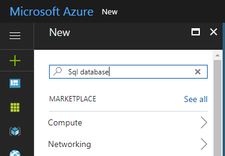
### 2.2. Fill in the detail and create database

### 2.3. Create tables in database
###### 2.3.1. Click "Tools" in Overview
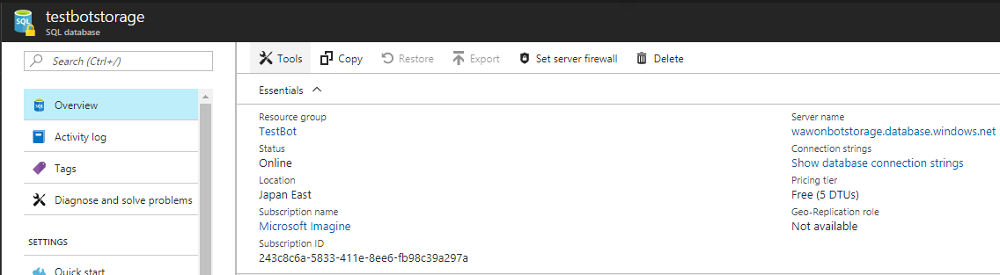
###### 2.3.2. Click "Query editor" in Tools
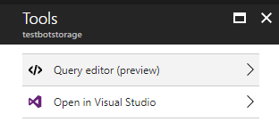
###### 2.3.3. Login to the SQL server
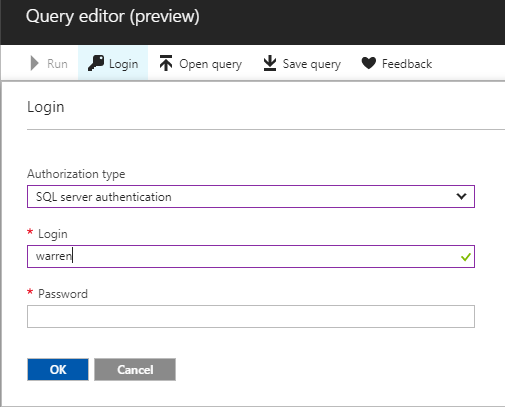
###### 2.3.4. Fill in the SQL command and create tables
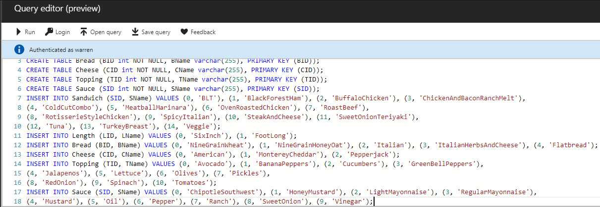
```sql
CREATE TABLE Sandwich (SID varchar(255) NOT NULL, PRIMARY KEY (SID));
CREATE TABLE Length (LID varchar(255) NOT NULL, PRIMARY KEY (LID));
CREATE TABLE Bread (BID varchar(255) NOT NULL, PRIMARY KEY (BID));
CREATE TABLE Cheese (CID varchar(255) NOT NULL, PRIMARY KEY (CID));
CREATE TABLE Topping (TID varchar(255) NOT NULL, PRIMARY KEY (TID));
CREATE TABLE Sauce (SID varchar(255) NOT NULL, PRIMARY KEY (SID));
CREATE TABLE SandwichOrder (OID varchar(255) NOT NULL, SID varchar(255) NOT NULL, LID varchar(255) NOT NULL, BID varchar(255) NOT NULL, CID varchar(255) NOT NULL, Time DateTime, 
PRIMARY KEY (OID), FOREIGN KEY (SID) REFERENCES Sandwich(SID), FOREIGN KEY (LID) REFERENCES Length(LID),
FOREIGN KEY (BID) REFERENCES Bread(BID), FOREIGN KEY (CID) REFERENCES Cheese(CID));
CREATE TABLE OrderTopping (OID varchar(255) NOT NULL, TID varchar(255) NOT NULL, FOREIGN KEY (OID) REFERENCES SandwichOrder(OID), FOREIGN KEY (TID) REFERENCES Topping(TID));
CREATE TABLE OrderSauce (OID varchar(255) NOT NULL, SID varchar(255) NOT NULL, FOREIGN KEY (OID) REFERENCES SandwichOrder(OID), FOREIGN KEY (SID) REFERENCES Sauce(SID));
INSERT INTO Sandwich (SID) VALUES ('BLT'), ('BlackForestHam'), ('BuffaloChicken'), ('ChickenAndBaconRanchMelt'), ('ColdCutCombo'), ('MeatballMarinara'), ('OvenRoastedChicken'), ('RoastBeef'),
('RotisserieStyleChicken'), ('SpicyItalian'), ('SteakAndCheese'), ('SweetOnionTeriyaki'), ('Tuna'), ('TurkeyBreast'), ('Veggie');
INSERT INTO Length (LID) VALUES ('SixInch'), ('FootLong');
INSERT INTO Bread (BID) VALUES ('NineGrainWheat'), ('NineGrainHoneyOat'), ('Italian'), ('ItalianHerbsAndCheese'), ('Flatbread');
INSERT INTO Cheese (CID) VALUES ('American'), ('MontereyCheddar'), ('Pepperjack');
INSERT INTO Topping (TID) VALUES ('Avocado'), ('BananaPeppers'), ('Cucumbers'), ('GreenBellPeppers'),
('Jalapenos'), ('Lettuce'), ('Olives'), ('Pickles'), ('RedOnion'), ('Spinach'), ('Tomatoes');
INSERT INTO Sauce (SID) VALUES ('ChipotleSouthwest'), ('HoneyMustard'), ('LightMayonnaise'), ('RegularMayonnaise'),
('Mustard'), ('Oil'), ('Pepper'), ('Ranch'), ('SweetOnion'), ('Vinegar');)
```
### 2.4. Set firewall rules
###### 2.4.1. Click "Set server firewall" in Tools
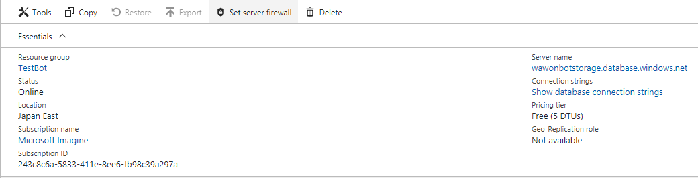
###### 2.4.2. Manage the rules (Allow specfic IP to access the SQL server)
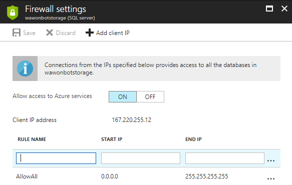

---

## 3. Create IForm in Bot Framework
### 3.1. Add new class in the project

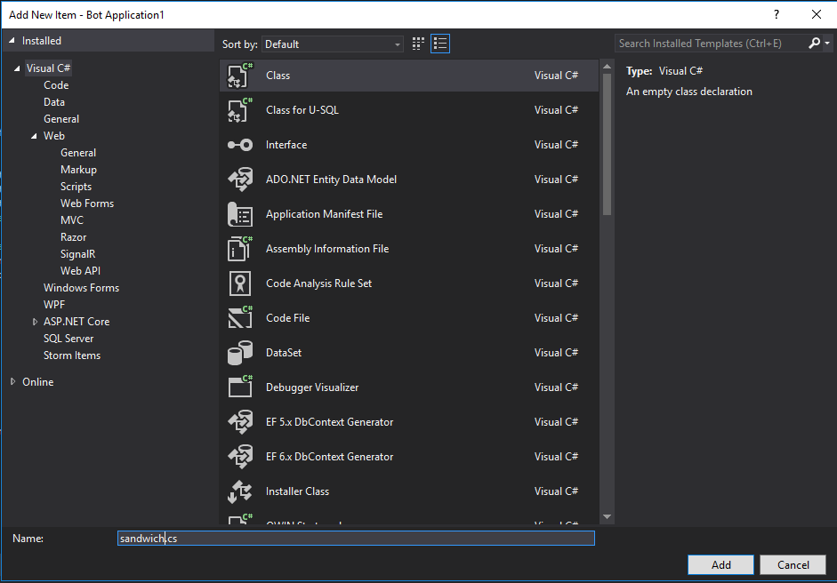
### 3.2. Copy the follow code in the class
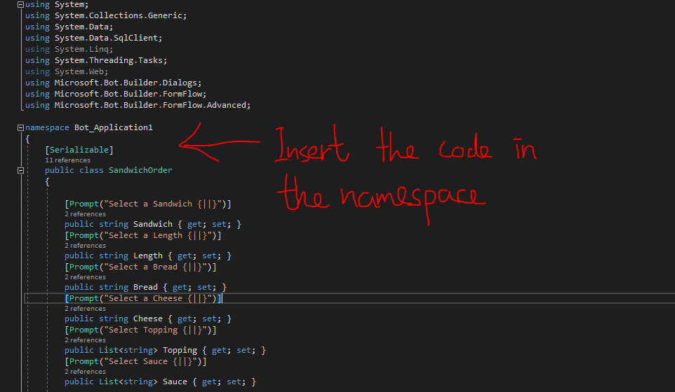
```cs
    [Serializable]
    public class SandwichOrder
    {
        [Prompt("Select a Sandwich {||}")]
        public string Sandwich { get; set; }
        [Prompt("Select a Length {||}")]
        public string Length { get; set; }
        [Prompt("Select a Bread {||}")]
        public string Bread { get; set; }
        [Prompt("Select a Cheese {||}")]
        public string Cheese { get; set; }
        [Prompt("Select Topping {||}")]
        public List<string> Topping { get; set; }
        [Prompt("Select Sauce {||}")]
        public List<string> Sauce { get; set; }

        public static IForm<SandwichOrder> BuildForm()
        {
            string connectionString =
                "Your connection string";
            SqlConnection connection = new SqlConnection(connectionString);
            OnCompletionAsyncDelegate<SandwichOrder> processOrder = async (context, state) =>
            {
                connection.Open();
                string queryString = string.Format("INSERT INTO SandwichOrder (OID, SID, LID, BID, CID, Time) VALUES ('{0}', '{1}', '{2}', '{3}', '{4}', '{5}')", context.Activity.Id, state.Sandwich, state.Length, state.Bread, state.Cheese, DateTime.Now.ToString("s"));
                SqlCommand command = new SqlCommand(queryString, connection);
                command.ExecuteNonQuery();
                foreach (string i in state.Topping)
                {
                    string queryString2 = string.Format("INSERT INTO OrderTopping (OID, TID) VALUES ('{0}', '{1}')", context.Activity.Id, i);
                    SqlCommand command2 = new SqlCommand(queryString2, connection);
                    command2.ExecuteNonQuery();
                }
                foreach (string i in state.Sauce)
                {
                    string queryString2 = string.Format("INSERT INTO OrderSauce (OID, SID) VALUES ('{0}', '{1}')", context.Activity.Id, i);
                    SqlCommand command2 = new SqlCommand(queryString2, connection);
                    command2.ExecuteNonQuery();
                }
                connection.Close();
                await context.PostAsync("We are currently processing your sandwich. We will message you the status.");
            };
            List<string> GetOption(string Table, string OptionName)
            {
                DataSet ds = new DataSet();
                List<string> rtnList = new List<string>();
                string queryString = string.Format("SELECT {0} FROM {1}", OptionName, Table);
                SqlCommand command = new SqlCommand(queryString, connection);
                SqlDataAdapter sqlDataAdapter = new SqlDataAdapter();
                sqlDataAdapter.SelectCommand = command;
                sqlDataAdapter.Fill(ds);
                foreach (DataRow dr in ds.Tables["Table"].Rows)
                {
                    rtnList.Add(dr[OptionName].ToString());
                }
                return rtnList;
            }
            return new FormBuilder<SandwichOrder>()
                    .Message("Welcome to sandwich making bot!")
                    .Field(new FieldReflector<SandwichOrder>(nameof(Sandwich))
                            .SetType(null)
                            .SetDefine((state, field) =>
                            {
                                foreach (var prod in GetOption("Sandwich", "SID"))
                                    field
                                        .AddDescription(prod, prod)
                                        .AddTerms(prod, prod);

                                return Task.FromResult(true);
                            }))
                    .Field(new FieldReflector<SandwichOrder>(nameof(Length))
                            .SetType(null)
                            .SetDefine((state, field) =>
                            {
                                foreach (var prod in GetOption("Length", "LID"))
                                    field
                                        .AddDescription(prod, prod)
                                        .AddTerms(prod, prod);

                                return Task.FromResult(true);
                            }))
                    .Field(new FieldReflector<SandwichOrder>(nameof(Bread))
                            .SetType(null)
                            .SetDefine((state, field) =>
                            {
                                foreach (var prod in GetOption("Bread", "BID"))
                                    field
                                        .AddDescription(prod, prod)
                                        .AddTerms(prod, prod);

                                return Task.FromResult(true);
                            }))
                    .Field(new FieldReflector<SandwichOrder>(nameof(Cheese))
                            .SetType(null)
                            .SetDefine((state, field) =>
                            {
                                foreach (var prod in GetOption("Cheese", "CID"))
                                    field
                                        .AddDescription(prod, prod)
                                        .AddTerms(prod, prod);

                                return Task.FromResult(true);
                            }))
                    .Field(new FieldReflector<SandwichOrder>(nameof(Topping))
                            .SetType(null)
                            .SetDefine((state, field) =>
                            {
                                foreach (var prod in GetOption("Topping", "TID"))
                                    field
                                        .AddDescription(prod, prod)
                                        .AddTerms(prod, prod);

                                return Task.FromResult(true);
                            }))
                    .Field(new FieldReflector<SandwichOrder>(nameof(Sauce))
                            .SetType(null)
                            .SetDefine((state, field) =>
                            {
                                foreach (var prod in GetOption("Sauce", "SID"))
                                    field
                                        .AddDescription(prod, prod)
                                        .AddTerms(prod, prod);

                                return Task.FromResult(true);
                            }))
                    .AddRemainingFields()
                    .Confirm("You ordered: {Length} {Sandwich} on {Bread} {&Bread} with {[{Cheese} {Topping} {Sauce}]}")
                    .OnCompletion(processOrder)
                    .Build();
        }
    };
```
### 3.3. Explaination of the code
###### 3.3.1 The form option (Can be string, int, list...)
For more information: https://docs.microsoft.com/en-us/bot-framework/dotnet/bot-builder-dotnet-formflow
```cs
[Prompt("Select a Sandwich {||}")]
public string Sandwich { get; set; }
[Prompt("Select a Length {||}")]
public string Length { get; set; }
[Prompt("Select a Bread {||}")]
public string Bread { get; set; }
[Prompt("Select a Cheese {||}")]
public string Cheese { get; set; }
[Prompt("Select Topping {||}")]
public List<string> Topping { get; set; }
[Prompt("Select Sauce {||}")]
public List<string> Sauce { get; set; }
```
###### 3.3.2 SQL connection by ADO.NET
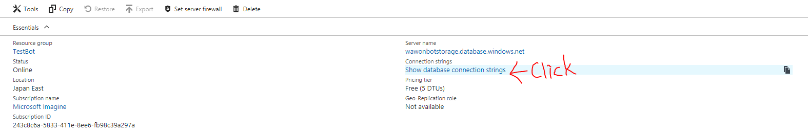

```cs
string connectionString ="Paste the copied connection string here";
SqlConnection connection = new SqlConnection(connectionString);
```
In GetOption method, it used SqlDataAdapter to get options from SQL server and fill Dataset. Then extract the data from dataset and return the option list like Sandwich option, Length option....
```cs
List<string> GetOption(string Table, string OptionName)
{
    DataSet ds = new DataSet();
    List<string> rtnList = new List<string>();
    string queryString = string.Format("SELECT {0} FROM {1}", OptionName, Table);
    SqlCommand command = new SqlCommand(queryString, connection);
    SqlDataAdapter sqlDataAdapter = new SqlDataAdapter();
    sqlDataAdapter.SelectCommand = command;
    sqlDataAdapter.Fill(ds);
    foreach (DataRow dr in ds.Tables["Table"].Rows)
    {
        rtnList.Add(dr[OptionName].ToString());
    }
    return rtnList;
}
```
You can insert or update data in SQL on form completeion as well. SqlDataAdapter can also execute insert and update command.
```cs
OnCompletionAsyncDelegate<SandwichOrder> processOrder = async (context, state) =>
{
    connection.Open();
    string queryString = string.Format("INSERT INTO SandwichOrder (OID, SID, LID, BID, CID, Time) VALUES ('{0}', '{1}', '{2}', '{3}', '{4}', '{5}')", context.Activity.Id, state.Sandwich, state.Length, state.Bread, state.Cheese, DateTime.Now.ToString("s"));
    SqlCommand command = new SqlCommand(queryString, connection);
    command.ExecuteNonQuery();
    foreach (string i in state.Topping)
    {
        string queryString2 = string.Format("INSERT INTO OrderTopping (OID, TID) VALUES ('{0}', '{1}')", context.Activity.Id, i);
        SqlCommand command2 = new SqlCommand(queryString2, connection);
        command2.ExecuteNonQuery();
    }
    foreach (string i in state.Sauce)
    {
        string queryString2 = string.Format("INSERT INTO OrderSauce (OID, SID) VALUES ('{0}', '{1}')", context.Activity.Id, i);
        SqlCommand command2 = new SqlCommand(queryString2, connection);
        command2.ExecuteNonQuery();
    }
    connection.Close();
    await context.PostAsync("We are currently processing your sandwich. We will message you the status.");
};
```
###### 3.3.3 Add logic in Formflow
"SetDefine" method is used to get options from SQL server in this demo.
```cs
public static IForm<SandwichOrder> BuildForm()
{
    ...
    return new FormBuilder<SandwichOrder>()
                    .Message("Welcome to sandwich making bot!")
                    .Field(new FieldReflector<SandwichOrder>(nameof(Sandwich))
                            .SetType(null)
                            .SetDefine((state, field) =>
                            {
                                foreach (var prod in GetOption("Sandwich", "SID"))
                                    field
                                        .AddDescription(prod, prod)
                                        .AddTerms(prod, prod);

                                return Task.FromResult(true);
                            }))
                    .Field(new FieldReflector<SandwichOrder>(nameof(Length))
                            .SetType(null)
                            .SetDefine((state, field) =>
                            {
                                foreach (var prod in GetOption("Length", "LID"))
                                    field
                                        .AddDescription(prod, prod)
                                        .AddTerms(prod, prod);

                                return Task.FromResult(true);
                            }))
                    .Field(new FieldReflector<SandwichOrder>(nameof(Bread))
                            .SetType(null)
                            .SetDefine((state, field) =>
                            {
                                foreach (var prod in GetOption("Bread", "BID"))
                                    field
                                        .AddDescription(prod, prod)
                                        .AddTerms(prod, prod);

                                return Task.FromResult(true);
                            }))
                    .Field(new FieldReflector<SandwichOrder>(nameof(Cheese))
                            .SetType(null)
                            .SetDefine((state, field) =>
                            {
                                foreach (var prod in GetOption("Cheese", "CID"))
                                    field
                                        .AddDescription(prod, prod)
                                        .AddTerms(prod, prod);

                                return Task.FromResult(true);
                            }))
                    .Field(new FieldReflector<SandwichOrder>(nameof(Topping))
                            .SetType(null)
                            .SetDefine((state, field) =>
                            {
                                foreach (var prod in GetOption("Topping", "TID"))
                                    field
                                        .AddDescription(prod, prod)
                                        .AddTerms(prod, prod);

                                return Task.FromResult(true);
                            }))
                    .Field(new FieldReflector<SandwichOrder>(nameof(Sauce))
                            .SetType(null)
                            .SetDefine((state, field) =>
                            {
                                foreach (var prod in GetOption("Sauce", "SID"))
                                    field
                                        .AddDescription(prod, prod)
                                        .AddTerms(prod, prod);

                                return Task.FromResult(true);
                            }))
                    .AddRemainingFields()
                    .Confirm("You ordered: {Length} {Sandwich} on {Bread} {&Bread} with {[{Cheese} {Topping} {Sauce}]}")
                    .OnCompletion(processOrder)
                    .Build();
    }
```

---

## 4. Connect the form to the framework
See [Microsoft Bot Framework Document](https://docs.microsoft.com/en-us/bot-framework/dotnet/bot-builder-dotnet-formflow)
> To connect the form to the framework, you must add it to the controller. In this example, the Conversation.SendAsync method calls the static MakeRootDialog method, which in turn, calls the FormDialog.FromForm method to create the SandwichOrder form.
```cs
//In MessageController.cs
internal static IDialog<SandwichOrder> MakeRootDialog()
{
    return Chain.From(() => FormDialog.FromForm(SandwichOrder.BuildForm));
}

[ResponseType(typeof(void))]
public virtual async Task<HttpResponseMessage> Post([FromBody] Activity activity)
{
    if (activity != null)
    {
        switch (activity.GetActivityType())
        {
            case ActivityTypes.Message:
                await Conversation.SendAsync(activity, MakeRootDialog);
                break;

            case ActivityTypes.ConversationUpdate:
            case ActivityTypes.ContactRelationUpdate:
            case ActivityTypes.Typing:
            case ActivityTypes.DeleteUserData:
            default:
                Trace.TraceError($"Unknown activity type ignored: {activity.GetActivityType()}");
                break;
        }
    }
    ...
}
```

---
## 5. Test the Chatbot
### 5.1. Debug the Chatbot in emulator
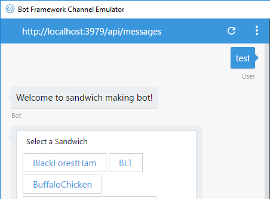
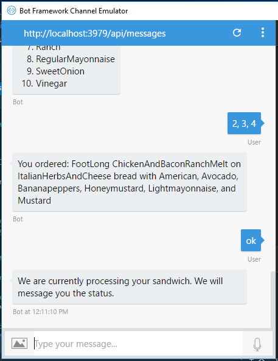
### 5.2. Check if the record exists in SQL server
###### 5.2.1 Click "Tools" in Overview

###### 5.2.2. Click "Query editor" in Tools

###### 5.2.3. Login to the SQL server

###### 5.2.4 Fill in the SQL command and check if the record exists
```sql
SELECT * FROM SandwichOrder;
```
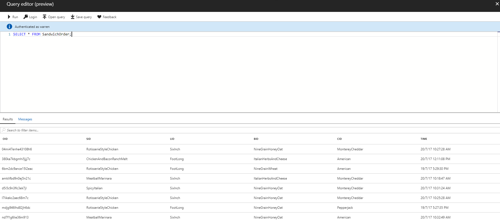


